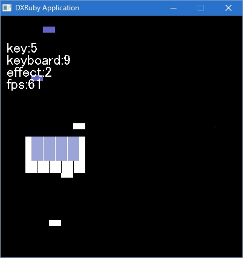

## game

サンプル

SpriteクラスおよびRenderTargetクラスを使っています

### Sprite
描画　移動　当たり判定　画面外のオブジェクト消し

### RenderTarget
描画先



```ruby
#coding:utf-8
require "dxruby"

Dir.chdir File.dirname(File.expand_path(__FILE__))
Window.width  = 400
Window.height = 400
TASK            = Object.new.extend Module.new{attr_accessor :scene , :scene_sys ,
  :key , :tips , :effect , :keyboard}
TASK.scene      = []
TASK.scene_sys  = []
TASK.effect     = []
TASK.key        = []
TASK.tips       = []
TASK.keyboard       = []
  RENDER     = RenderTarget.new Window.width , Window.height
  SCREEN  = Sprite.new 0 - (cpad = 20) , 0 - cpad , Image.new(Window.width + cpad , Window.height + cpad , [255,255,255])
  TASK.scene_sys.push RENDER , SCREEN
SOUND                       = Object.new.extend Module.new{attr_accessor :BGM,:SE }
#SOUND.BGM                   = Sound.new "./sound/sample6.wav" # ; sleep 1
SOUND.SE                    = Object.new.extend Module.new{attr_accessor :USER_SHOT_CREATE, :USER_SHOT_SHOT , :ENEMY_CREATE , :ENEMY_SHOT_CREATE , :ENEMY_HIT ,:ENEMY_SHOT_SHOT , :USER_HIT }
IMAGE                 = Object.new.extend Module.new{attr_accessor :key, :key2 , :keyboard , :keyboard2, :User , :effect , :background }
IMAGE.background      = nil
IMAGE.key             = Image.new(20,10,[255,255,255])
IMAGE.key2            = Image.new(20,10,[100,100,200])
IMAGE.keyboard2       = Image.new(20,40,[155,165,215])
IMAGE.keyboard        = Image.new(20,60,[255,255,255])
IMAGE.keyboard. box_fill 0,0,0,IMAGE.keyboard.height,[0,0,0]
IMAGE.keyboard2.box_fill 0,0,0,IMAGE.keyboard2.height,[255,255,255]

IMAGE.effect          = Image.new( 5, 5,[200,140,200,200])

def Window.screenshot dir = "_screenshot"
   pwd = Dir.pwd
   Dir.chdir File.dirname(File.expand_path(__FILE__))
   Dir.mkdir( dir ) unless File.exist?( dir )
   file  =  dir + "/sc_" + Time.new.strftime("%Y_%m_%d__%H_%M_%S") + ".jpg"
   Window.getScreenShot( file )
   Dir.chdir pwd
   return file
end

module Game_object ; attr_accessor :speed , :sym    end
class Game_object_main < Sprite
  include Game_object
  def initialize *_
    super
    self.target = RENDER
  end
end
class Key < Game_object_main
  def initialize x , y , image , sym = :Key
    super x , y , image
    @sym = sym
    @speed = 4
#    self.collision = [ 0 , 0 , ]
  end
  def update
    self.y += @speed
  end
  def hit o
    self.vanish
  end
end
class Keyboard < Game_object_main
  def initialize x , y , image , sym = :Keyboard
    super x , y , image
    @sym = sym
  end
  def update
  end
  def shot o
    o.vanish
  end
end
class User < Game_object_main
  def initialize x , y , image , sym = :Keyboard
    super x , y , image
    @sym = sym
    self.visible
  end
  def update

    TASK.keyboard.zip([K_Z,K_X,K_C,K_V,K_B,
                   K_S,K_D,K_F,K_G])
    .flatten.each_slice(2) do | keyboard , vkey |
    if Input.keyDown? vkey
      keyboard.check(TASK.key).each do|t|
        t.vanish
        TASK.effect << Effect.new( t.x , t.y , IMAGE.effect)
      end
#      keyboard.scale_x = 1.3
      keyboard.scale_y = 1.3
    else
#      keyboard.scale_x = 1
      keyboard.scale_y = 1
    end
    end
  end
  def shot o
    o.vanish
  end
end


class Effect < Game_object_main
  def initialize x , y , image , sym = :effect0
    10.times do
        TASK.effect << Effect_sub.new(x , y , image , 2+rand(10))
        TASK.effect << Effect_sub.new(x , y , image , -2-rand(10))
    end
    self.vanish
  end
end
class Effect_sub < Game_object_main
  def initialize x , y , image , speed ,sym = :effect0
    super x , y , image
    @speed = speed
    self.alpha = rand(360)
    self.angle = rand(360)
  end
  def update
    self.x += @speed
  end
end

class Scene_progression
  def initialize
    @count = (Array 0..200).cycle
    init
  end
  def init
     TASK.scene_sys << User.new( 0, 0, nil )
     y  = 200
     TASK.keyboard << Keyboard.new(40  , y , IMAGE.keyboard)
     TASK.keyboard << Keyboard.new(60  , y , IMAGE.keyboard)
     TASK.keyboard << Keyboard.new(80  , y , IMAGE.keyboard)
     TASK.keyboard << Keyboard.new(100 , y , IMAGE.keyboard)
     TASK.keyboard << Keyboard.new(120 , y , IMAGE.keyboard)

     TASK.keyboard << Keyboard.new(50  , y , IMAGE.keyboard2)
     TASK.keyboard << Keyboard.new(70  , y , IMAGE.keyboard2)
     TASK.keyboard << Keyboard.new(90  , y , IMAGE.keyboard2)
     TASK.keyboard << Keyboard.new(110 , y , IMAGE.keyboard2)
  end
  def update
    a = 40
    case @count.next
    when 1
      TASK.key << Key.new( a + 0 , IMAGE.key.height ,IMAGE.key )
    when 20
      TASK.key << Key.new( a + 20 , IMAGE.key.height ,IMAGE.key )
    when 40
      TASK.key << Key.new( a + 40 , IMAGE.key.height ,IMAGE.key )
    when 60
      TASK.key << Key.new( a + 60 , IMAGE.key.height ,IMAGE.key )
    when 80
      TASK.key << Key.new( a + 80 , IMAGE.key.height ,IMAGE.key )
    when 100
      TASK.key << Key.new( a + 10 , IMAGE.key2.height ,IMAGE.key2 )
    when 120
      TASK.key << Key.new( a + 30 , IMAGE.key2.height ,IMAGE.key2 )
    when 140
      TASK.key << Key.new( a + 50 , IMAGE.key2.height ,IMAGE.key2 )
    when 160
      TASK.key << Key.new( a + 70 , IMAGE.key2.height ,IMAGE.key2 )
    end
  end
end


#TASK.keyboard << Keyboard.new(40 , 200 , IMAGE.keyboard)
# TASK.scene << Background.new
TASK.scene_sys << Scene_progression.new
Window.loop do ; exit if Input.keyPush? K_F9 ; exit if Input.keyPush? K_ESCAPE ; Window.screenshot if Input.keyPush? K_F12
  Sprite.update TASK.scene_sys
  Sprite.update [ TASK.key ,  TASK.keyboard , TASK.effect , TASK.scene , ]
  Sprite.draw   [ TASK.key ,  TASK.keyboard , TASK.effect , TASK.scene , ]
#  Sprite.check    TASK.user      , [ TASK.enemy , TASK.enemy_shot ].flatten

#  Sprite.check    TASK.keyboard , TASK.key
  Sprite.clean  [ TASK.key , TASK.effect ]
  TASK.key      = SCREEN.check TASK.key
  TASK.effect   = SCREEN.check TASK.effect

  RENDER.draw_font 10, 40,"key:#{TASK.key.size}",Font.default
  RENDER.draw_font 10, 60,"keyboard:#{TASK.keyboard.size}",Font.default
  RENDER.draw_font 10, 80,"effect:#{TASK.effect.size}",Font.default
  RENDER.draw_font 10, 100,"fps:#{Window.fps}",Font.default
  Window.draw 0, 0, RENDER

end


```
